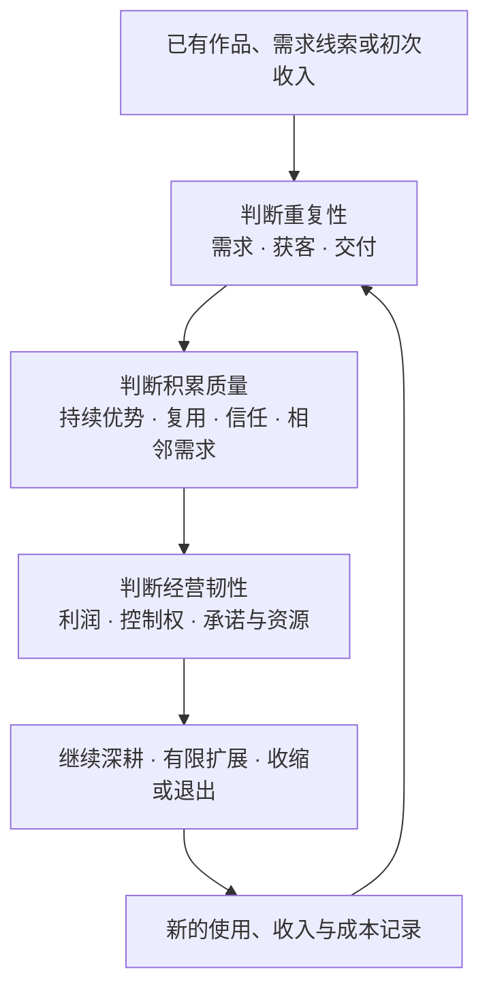
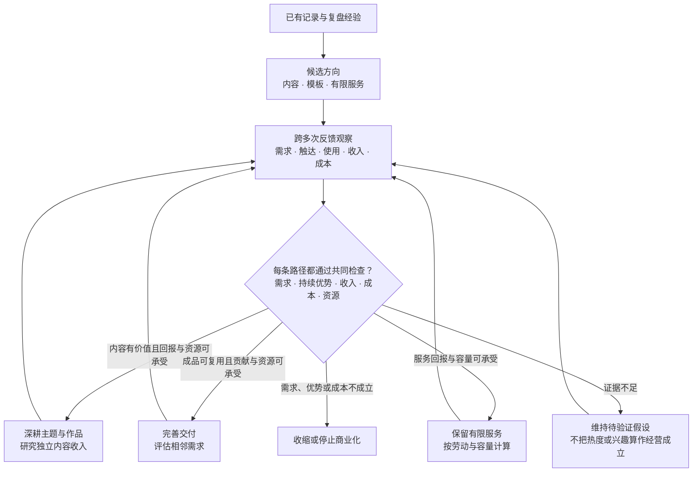

# 中期赚钱的思考框架：持续收入与有效积累

总览 [[思考：长期、中期、短期赚钱方式]] · 前篇 [[短期赚钱方式：机会发现与可行判断]] · 后续 [[长期赚钱方式：价值留存与选择权]]

> 短期问“这个机会为什么适合现在的我”；中期问“什么值得持续投入，怎样让下一次不必从头开始”。本文是判断框架，不是产品线教程、平台报告或按月执行计划。它适用于内容、商品、软件、授权和服务，不保证收入或增长。

“中期”可暂以几个月至半年作为观察尺度，但不是期限承诺。关键不是经营了多久，而是开始跨多次创作、交易和维护，判断收入来源是否可重复、投入是否在积累。没有成交时，也可以建设作品与受众；只是不能把建设进度当成经营验证。

*图一：中期是持续校正的循环，不是从第一单自动通往规模化的阶梯。短期框架中的需求、差异、边界和证伪仍然适用。*

## 一、判断重复性：不是偶然赚到，而是知道为什么还能发生

### 需求延续思维：下一笔收入从哪里来

同一客户持续需要、不同客户不断出现相似需求，是两种不同的持续性。简历不一定被同一个人频繁购买，仍可能不断有新的求职者；工具被反复使用，也不意味着用户愿意反复付费。

**下一笔钱来自复购、续费、转介绍，还是新的同类客户？需求何时会结束？**

### 获客复现思维：不把爆款当作稳定渠道

一次热门视频、熟人支持或平台推荐，可以带来收入，却未必能重复。内容、搜索、社区与合作关系能否持续触达合适的人，需要跨多个作品或交易周期观察。

**如果没有上次的偶然曝光，下一批相关用户会从哪里来？**

### 交付结构思维：增长是否只能靠自己更忙

数字商品不一定低维护，服务也不一定毫无积累。关键在于哪些工作能够复用，哪些必须保留人工；标准化可以减少重复判断，但不能假装消除了个别需求。

**再来一批用户，哪些成果可直接复用，哪些工作和责任会随人数增长？**

## 二、判断积累质量：做得更多，是否真的更有价值

### 复用思维：区分资产积累与库存堆积

文章数量、模板数量、代码量，都不是积累质量本身。旧成果仍被阅读、使用、引用或购买，才说明它可能继续发挥作用；过时内容和无人使用的功能也会形成维护负担。

**新投入是在增强已有成果，还是制造更多需要照料的东西？**

### 信任思维：持续选择你的理由是否更充分

内容可以独立通过付费阅读、合作、赞赏或授权取得收入，不必最终导向软件。无论卖什么，可信作品、真实体验和兑现承诺，都可能帮助下一位用户判断；但粉丝数不等于信任，更不等于付费意愿。

**用户持续回来，是因为独特价值、稳定体验或可信关系，还是只能依赖每次重新争取曝光？**

### 持续优势思维：选择你的理由是在加强还是消失

需求仍在，不等于用户仍会选择你。免费替代、AI、竞争者和用户自身能力都会变化；反复解决同一类问题、积累作品与关系，才可能让优势变得更具体。优势不必独一无二，但必须对相关用户有实际意义。

**经过一段时间，我的优势是因经验、作品和关系而增强，还是正在被替代？用户继续选择或离开的原因是什么？**

### 相邻扩展思维：围绕需求生长，不围绕制作能力堆叠

同一人群的下一项问题、同一作品的新用途、更广的合法使用范围，都可能形成延展。但客户偶尔提出的要求，不自动值得发展为新品。

**扩展能否复用已有受众、成果与经验？不扩展，先改善现有交付是否更值得？**

## 三、判断经营韧性：收入增长之后，自己是否更从容

### 利润质量思维：不把营业额和订阅额当作可支配收入

平台费用、推广、退款、运行、更新、支持和自己的劳动，都可能随收入增加。预收年费带来的现金，还对应未来的交付责任；增长也可能先消耗现金。

**把自己的劳动计入成本后，回报是否值得？收入增加时，是否必须同比增加劳动？回款与履约支出是否错配？**

### 控制权思维：关键条件掌握在谁手里

受众、货源、客户关系、定价、版权与交付能力可能分属不同主体。依赖平台并非错误，但平台改规则、供应商涨价或主要客户离开时，影响需要能被理解。

**哪一个外部变化会使收入明显受损？有没有合规可用的替代路径，以及转换成本？**

### 承诺与资源思维：未来收入是否换来了过重义务

订阅、会员、终身更新和服务包，不只是收费方式，也是未来工作。没有持续价值的需求，不应只为重复收费而改成订阅；新增产品和渠道也会占用注意力。

**现有时间、资金与能力能否兑现承诺？继续这一条路，会放弃哪些更好的选择？**

## 四、贯穿全程：用持续证据决定加码、收缩或退出

- 一次成交可能证明一次交换；多个独立交易才有助于检查可重复性。
- 回访、使用与续费是不同信号，不互相替代；没有复购不一定失败，要看收入机制。
- 比较多个时段的收入、成本与投入，区分活动带来的暂时变化与持续改善。
- 发现价格无法覆盖支持、旧成果迅速失效或新增渠道只增加忙碌时，应允许收缩。

**最重要的不是“已经坚持多久”，而是“新证据是否仍支持继续投入”。** 尚无足够证据时保留假设，不预设某个月必须盈利，也不因前期投入多而持续追加。

## 五、用短例子连接不同赚钱方式

以下是候选路径，不是市场结论；它们是否成立，需要分别研究。

| 候选方式 | 中期值得观察的积累 | 容易误判的地方 |
|---|---|---|
| 围绕熟悉主题写文章、做视频 | 旧作品持续被发现，读者理解加深，内容收入来源逐渐清楚 | 日更、粉丝或播放增长，不等于收入稳定；内容不必成为商品引流附件 |
| 原创工作簿、素材或教程 | 同类用户能独立使用，共性问题得到解决，出现真实相邻需求 | 增加文件数量不是产品线，反复上新不代表旧商品有价值 |
| 本地工具或插件 | 重复使用、付费选择和维护成本逐渐可判断 | 使用频繁不等于愿意订阅，功能增长可能吞掉利润 |
| 固定范围的咨询或诊断 | 转介绍、案例、检查流程与更清楚的服务边界 | 服务可以形成持续收入，但仍要计算自己的时间与容量 |
| 原创作品授权、合规推荐或分销 | 可复用作品、合作关系及可核验结算 | 同一作品能否再次授权取决于协议；佣金增加不代表控制权增强 |
| 职业发展、长期合作或本地服务 | 能力成长、稳定报酬、客户或雇主关系 | 工作年限不等于议价能力，收入增长还要与劳动和健康成本比较 |
| 实体零售、手作经营或资产出租 | 供货能力、周转、复购、出租利用率与经营记录 | 营业额不是利润；库存、空置、维修和资金占用可能吃掉回报 |
| 家庭资金管理与分阶段投资安排 | 用款目标、结余、债务负担、配置与风险逐渐清楚 | 缴入本金不等于收益；用几个月的涨跌证明长期策略有效，也不可靠 |

更广的收入机制见 [[思考：长期、中期、短期赚钱方式#收入机制与三个时间视角：覆盖地图|总览覆盖地图]]；定投与价值投资属于资金安排和投资判断，不是固定月收入方案，详见 [[长期赚钱方式：价值留存与选择权#理财、定投与价值投资：让已有资金承担合适的任务|长期篇的投资讨论]]。

### 完整案例：每日记录与复盘，怎样判断值得持续经营？

**实际起点：** 当前记录库已有每日记录、周期复盘和模板结构。短期篇以此推演内容或成品的可能性。这里继续分析中期判断，**不假定已经获得读者、买家或收入，也不虚构增长数据。**

| 思维视角 | 放进这个案例后怎样判断 |
|---|---|
| **需求延续** | 如果有人购买模板，要区分“不断有新人需要初始结构”与“旧用户需要持续帮助”；前者未必适合订阅。 |
| **获客复现** | 如果一篇复盘文章受关注，要看其他相关内容和旧文章能否继续触达需要的人，而不是依据一次热度预估未来收入。 |
| **交付结构** | 若问题集中在相同安装步骤，说明和示例可能复用；若每个人都要重新配置整个库，应该按服务计算容量与收费。 |
| **复用** | 匿名示例、解释文章和模板能否互相补充，更新一处是否帮助更多人？无人使用的复杂功能不算经营积累。 |
| **信任** | 是否有人因具体解释、稳定体验或可信关系而再次阅读、主动推荐或回来？这些是信任线索，实际付款仍需另行观察。 |
| **持续优势** | 相比免费模板、AI 或其他创作者，现有方法是否因真实例子、清楚结构或持续解释而更适合某类人？若用户不再选择，应记录原因，而不是假定内容越多优势越大。 |
| **相邻扩展** | 若用户反复提出同一类周期回顾问题，可研究专题或扩展；不能因为容易制作，就添加无关的人生管理模块。 |
| **利润质量** | 把内容制作、答疑、插件兼容和更新的劳动也计入后，回报是否值得？收入增加是否要求同比增加时间？没有收入记录时，只能列出成本假设。 |
| **控制权** | 核心方法是否只能依靠某个插件？作品与版权是否保留？平台流量变化后，是否还有合规触达相关读者的途径？ |
| **承诺与资源** | 一次性模板、有限支持、持续专栏分别对应不同义务；不能用“永久更新”换首单，再把未来维护当作免费。 |
| **持续证据** | 若旧内容仍有价值而模板售后过重，可以保留内容、缩减模板；若两者都没有明确需求，也可以停止商业化，而保留个人使用。 |

*图二：条件推演，不是已发生的经营结果；几条路径可以有限组合，也可以只保留一条。持续观察不意味着永久等待，每次追加投入都需重新权衡。*

如果文章有持续阅读，但付费模板始终没有明确需求，不能把阅读增长算成模板验证；如果模板有人购买，但每位买家都需要大量配置帮助，就应按服务重新计算容量与收费；只有当共性说明减少支持、相关用户仍愿意选择，才有更多理由先完善现有成果，而不是立即扩展新品。

**案例结论：** 中期不必把一套模板强行扩成产品线，更不必最终做成 SaaS。值得持续经营的，可能是一组原创内容、一个窄工具或有边界的服务；选择取决于重复需求、持续优势、可保留收益和可承担的责任。

### 排除案例：卡券订单增加，不一定意味着经营变好

如果订单增加的同时，预付款、客服和失效纠纷也增加，而供货价格与终端售价都缺乏控制权，销量增长就未必改善自己的处境。若转向多级代理只是增加供货依赖，也不能把“代理等级提高”当成优势已经形成。

**判断依据应是合法可靠的供给、实际贡献、客户来源与风险承受能力，而不是规模外观。** 这是条件分析，不是断言所有卡券卖家都利润微薄；如果这些条件改善，可以重新评估。

中期的进步，不只是赚得更多，而是更清楚地知道：**收入为何继续发生，哪些成果值得保留，哪些依赖需要管理，以及什么不再值得做。**
