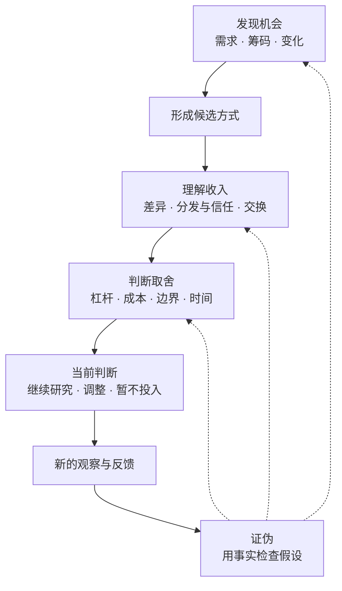
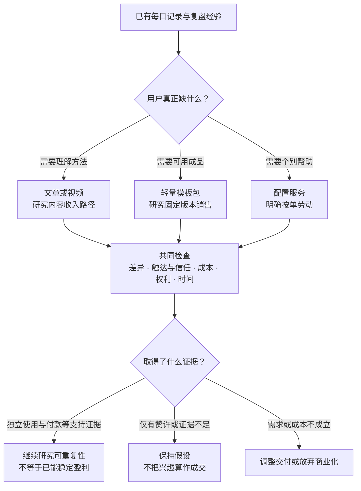

# 短期赚钱的思考框架：机会发现与可行判断

总览 [[思考：长期、中期、短期赚钱方式]] · 后续 [[中期赚钱方式：持续收入与有效积累]] · [[长期赚钱方式：价值留存与选择权]]

> 从不同角度发现短期收入机会，理解它如何成立，再判断是否适合自己。本文不是穷尽所有赚钱方式的清单，也不是经过验证的收益公式：**框架帮助提出和检查假设，具体机会仍需要证据。**

*图一：逻辑关系，不是固定操作顺序。可以从任一视角进入，并随新证据返回修改判断。*

## 一、发现机会：需求、筹码与变化

### 需求思维：人为什么愿意付钱

不只问“我能做什么”，也问“别人愿意为什么付钱”。节省时间、减少选择、降低风险、获得结果，以及审美、娱乐、陪伴和认同，都可能构成价值。

**谁在什么场景下，为了少做什么、避免什么或得到什么而付款？**

### 筹码思维：什么已经在自己手里

技能、经验、原创作品、行业理解、读者、关系、渠道、版权、信誉、时间和现金，都可能是起点。短期性不只取决于项目，也取决于自己是否需要从零开始。

**我已有的哪项筹码，能缩短从发现需求到收到钱的距离？**

### 变化思维：为什么现在出现机会

技术、规则、季节、生活阶段和工作流程的变化，可能带来新的需求或降低供给成本。发现变化不等于追风口，还要区分持续需求与短暂热度。

**什么变化让原来不容易做、不值得做的事变得可能？变化消失后，它还成立吗？**

## 二、理解收入：差异、分发与交换

### 差异思维：为什么这笔钱会由你赚到

“有人需要”和“我能做”之间，还隔着竞争。差异可以是更贴合场景、更可靠、更方便、更及时，或更有辨识度，不一定是技术壁垒。

差异不等于优势：关键是它是否让某类买家更愿意选择你，而且你现在就能提供。不必独一无二，但要避免“市场有需求，我也能做，所以我能赚钱”的跳跃。

**面对免费方案、AI 和其他卖家，对方为什么选择你？**

### 分发与信任思维：价值怎样到达付款者

有价值不等于被看见，被看见也不等于被信任。搜索入口、相关受众、真实作品、演示、评价和既有关系，分别可能帮助发现或降低购买疑虑。

**对方在哪里发现你，又凭什么在付款之前相信你？**

### 交换思维：能力怎样变成收入

同一种能力可以按时间或结果收费，也可以形成成品、软件、付费内容、版权许可，或通过广告、赞助、合作与推荐取得收入。使用者、受众和付款者不一定是同一群人。

**谁付钱、按什么单位付钱、付款后得到什么，收入何时真正到账？**

还要看议价能力与控制权：**价格、供货、客户关系和售后规则由谁决定？我创造了什么价值，又能留住其中多少收入？** 承担的责任多，不代表能决定的条件或留下的利润也多。

## 三、判断取舍：杠杆、成本、边界与时间

### 杠杆思维：一次劳动能留下什么

除了当次收入，劳动还可能留下可重复交付的作品、自动化流程、内容入口、版权、关系和再次触达用户的能力。这些是潜在积累，不是必然收益。

**停止新增投入后，什么仍会继续产生作用？**

### 成本思维：收入背后真正增加了什么

不只看售价、播放量、订单数或销售额，还要看前期制作、获客、沟通、交付、退款、运行、维护、税费与机会成本。

**每多一笔收入增加多少现金、时间和责任？它能否覆盖前期投入，相比其他选择是否值得？**

能赚钱不等于值得做。同样的时间和资金，用在另一条路径上，是否更接近回款、负担更小或积累更多？比较的是适合自己的机会，不只是某项生意是否存在收入。

### 边界思维：哪些前提不能含糊

合法使用与销售权利、真实宣传、交付范围、支持承诺和退出条件，决定交易能否持续。信息筛选可以创造价值，欺骗或隐瞒关键限制则不是；定制服务可以赚钱，但不能冒充自动收入。

**这笔交易的权利、交付、责任和退出边界是否清楚？**

### 时间思维：它适合现在，还是适合以后

第一笔收入、可重复收入、足以覆盖开支的收入，是三个不同阶段。同一方式对已有作品或渠道的人可能很近，对从零开始的人可能需要长期建设。

**它现在解决的是现金流，还是在建设未来资产？资金和时间能否支撑等到收入发生？**

不够可复制的工作，也可能适合解决眼前现金流；有积累的项目，也可能不适合当前投入。短期与长期不是优劣排名。

## 四、贯穿全程：证伪思维

把候选机会当作假设，不为已经喜欢的想法不断找理由。

- 观察到的是讨论、兴趣、成交，还是重复成交？
- 实际收入是否覆盖成本，还是只看到销售额？
- 什么事实会推翻当前判断？
- 下一条最小、合规且能改变判断的证据是什么？

**验证的是具体判断，不是给整套框架贴上“已验证”的标签。**

## 五、用短例子练习

以下是示意思路，不是市场结论或项目推荐。

| 候选方式 | 从哪里发现 | 再用其他视角追问 |
|---|---|---|
| 固定范围的网站性能诊断 | 筹码：已有排查经验 | 客户如何发现并信任你？每次诊断需要多少人工？共性问题能否留下检查清单？ |
| 原创预算／报价工作簿 | 需求：反复计算和组织报价 | 相比免费表格少了哪些工作？买家能否独立使用，还是必须逐人代填？ |
| 熟悉主题的文章或视频，如行业经验、生活技能、兴趣知识 | 筹码：已有理解；变化：出现新的疑问 | 谁愿意阅读，谁实际付款？适合稿费、付费专题还是合作？旧作品能否继续被找到？ |
| 处理单一重复任务的本地小工具 | 变化：新流程产生重复劳动 | 现有工具为什么不够？用户在哪里寻找解决办法？兼容和异常成本是否可控？ |
| 长期使用过的工具比较与建议 | 需求：用户难以选择 | 独立判断体现在哪里？相关读者如何找到你？推荐关系是否披露，佣金规则是否清楚？ |
| 匹配已有能力的岗位、兼职或本地服务 | 筹码：技能、可用时间、合作关系 | 招聘或客户成交需要多久？实际结算何时发生？通勤、沟通与劳动回报是否值得？ |
| 出售闲置、手工作品，或出租有权出租的设备 | 筹码：已有物品、制作能力或使用权 | 是一次性回收现金，还是有利润的重复交易？物流、损坏、空置与售后由谁承担？ |

同一件事可以有多种收入结构：诊断可以是服务，也可能沉淀为工具；文章可以取得稿费，也可能形成专题或授权作品。作品能否再次使用和销售，取决于自己保留的权利及相关协议。

资金相关机会也应接受短期检查：近期要用的钱能否及时、安全地取用，比追逐收益更重要。已有存款利息或租金可能带来现金流，但出售资产回款不等于净赚；投机涨价不应作为填补生活现金缺口的默认方案。更完整的收入机制见 [[思考：长期、中期、短期赚钱方式#收入机制与三个时间视角：覆盖地图|总览覆盖地图]]。

### 完整案例：每日记录与复盘经验，能否形成短期收入？

**实际起点：** 这个记录库已经采用每日记录、周期复盘、模板和统计的组织方式。由此提出一个候选机会：把相关经验整理成公开文章／视频，或一个可独立使用的轻量模板包。

**以下是基于实际场景的推演，不是已经成交的商业案例。** 用户需求、购买意愿、收入和支持成本均未在本案例中验证；不因自己正在使用，就假定别人也需要。

| 思维视角      | 放进这个案例后怎样思考                                       | 对候选机会的影响                                                     |
| --------- | ------------------------------------------------- | ------------------------------------------------------------ |
| **需求**    | 潜在用户可能不是缺模板，而是每天不知道记什么，或记了以后无法回顾。也可能根本没有这个困扰。     | 研究对象从“卖一套 Obsidian 配置”转为“帮助某类人把记录用于回顾”；需求仍是假设。               |
| **筹码**    | 已有每日记录结构和复盘流程，可用来解释设计取舍。但尚不能据此声称有长期效果、读者基础或销售经验。  | 可以利用现有结构制作匿名示例，不必先开发新应用；公开的是可分享的方法，不是私人笔记。                   |
| **变化**    | AI 可以参与记录总结，但本案例尚无证据说明它带来了付费需求。它也可能使读者更容易自行生成模板。  | “AI 复盘”不能直接充当卖点；需要理解用户缺的是总结能力、记录习惯，还是可回顾的结构。没有变化证据也不必强凑风口。   |
| **差异**    | 免费模板和 AI 都是替代品。候选差异不是文件更多，而是每日到周期的衔接清楚、说明易懂、依赖较少。 | 若现有免费方案已足够，或者所谓差异只有自己看得懂，付费模板的理由就减弱。                         |
| **分发与信任** | 一篇展示“同一份示例记录如何进入周复盘”的文章或视频，能让读者看见过程；但发布不等于找到需要的人。 | 内容既可独立创作，也可解释成品。需要知道相关读者在哪里，而不能预设新账号靠流量分成迅速赚钱。               |
| **交换**    | 内容可探索稿费、付费专题等路径；模板包可出售固定版本；替人配置则是另一种服务。           | 区分“读者购买理解”“用户购买成品”“客户购买配置服务”，不把三者混成一个模糊承诺。具体收入方式仍需满足渠道与付款条件。 |
| **杠杆**    | 原创说明、匿名示例、模板和共性问题解答可能重复使用。                        | 同一次整理可留下内容和成品，但是否持续带来收入取决于后续发现与使用，不是自动复利。                    |
| **成本**    | 制作之外，还可能有插件兼容、安装说明、使用答疑和版本更新。                     | 如果每位买家都要远程配置，即使文件自动发出，也不是低按单劳动的商品。                           |
| **边界**    | 应剔除私人记录和敏感配置，核对第三方代码与素材许可，并写清支持范围。                | 只交付有权分享的原创结构和示例，不承诺改善心理健康，也不承诺永久适配所有插件版本。                    |
| **时间**    | 现有积累缩短了制作距离，没有现成买家则未必缩短成交距离。                      | 可以作为短期候选，但不能当作已确定的现金流；先得到阅读、第一次付款和稳定收入是不同阶段。                 |
| **证伪**    | 若读者只需要一篇免费说明、模板无法独立上手，或支持成本超过收入，原先的判断就需要改变。       | 不继续为“模板一定能卖”找理由：可以保留内容、缩小交付、诚实转为有限服务，或放弃商业化。                 |

**推演后的结论不是“去卖模板”，而是：** 现有经验值得形成一个候选方向，但“读者需要理解方法”和“买家愿意购买成品”是两个不同假设。尚不能确定采用哪种收入结构，更不能确定短期收益。

能进一步改变判断的证据包括：相关用户具体卡在哪里、陌生人能否仅凭示例独立使用，以及在价格和支持边界清楚后是否真的购买。只收到“看起来不错”，还不足以支持付费商品的结论。

这个案例展示的不是从点子推导成功，而是**从“我有一套东西”出发，逐渐分清谁可能需要、为何选择、如何付款、自己承担什么，以及何时应改变判断。**

*图二：同一筹码可以形成不同收入结构。箭头表示待验证的分支，不代表实际用户反馈或已经获得收入。*

### 排除案例：有需求的会员卡券，为什么未必适合自己？

消费者希望便宜购买会员，是可以理解的需求；但这不证明自己具备有利的经营条件。以下是条件分析，不是行业利润统计。

- **差异与控制权：** 同款卡券容易比价。若没有可靠的采购优势，进货价由上游决定、售价受竞争约束，而自己仍承担售后，就可能留不住足够收益。
- **分发与成本：** 低成本客户来源、合法稳定的货源和清楚的售后安排缺一不可。自动发卡只减少交付动作，不消除推广、预付款、失效纠纷和退款成本。
- **时间与机会成本：** 即使能产生小额收入，也要比较它占用的时间与资金，是否比整理已有作品、提供有限服务等其他选择更值得。
- **证伪与重看：** 如果尚未具备这些条件，可以不把它作为当前主线；以后取得合规供货优势、稳定客户来源和可核验的经营贡献，再重新判断，而不是永久否定整个行业。

**需求成立，不代表自己的经营条件成立。** 不能仅凭卖家使用闲鱼就判断其盈利能力，也不能仅凭竞争者多就断言没有机会；应检查自己能否为特定买家提供优势，以及收益能否覆盖责任与成本。

