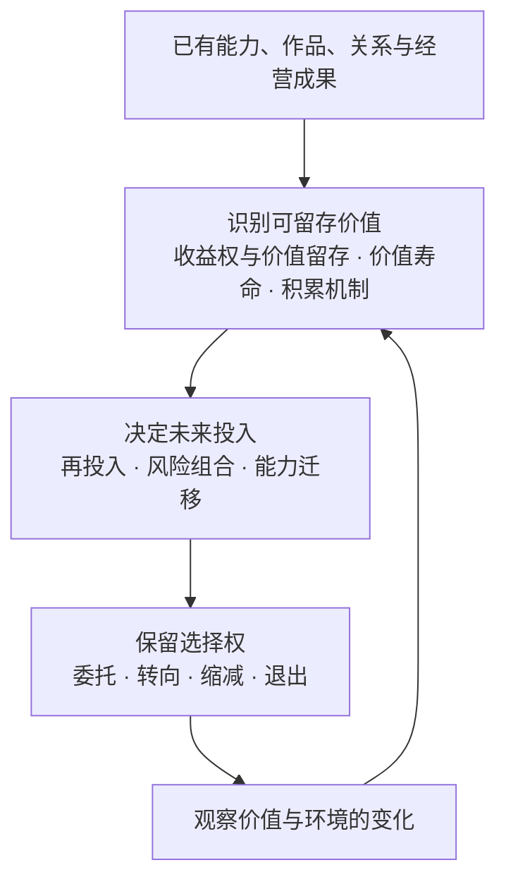
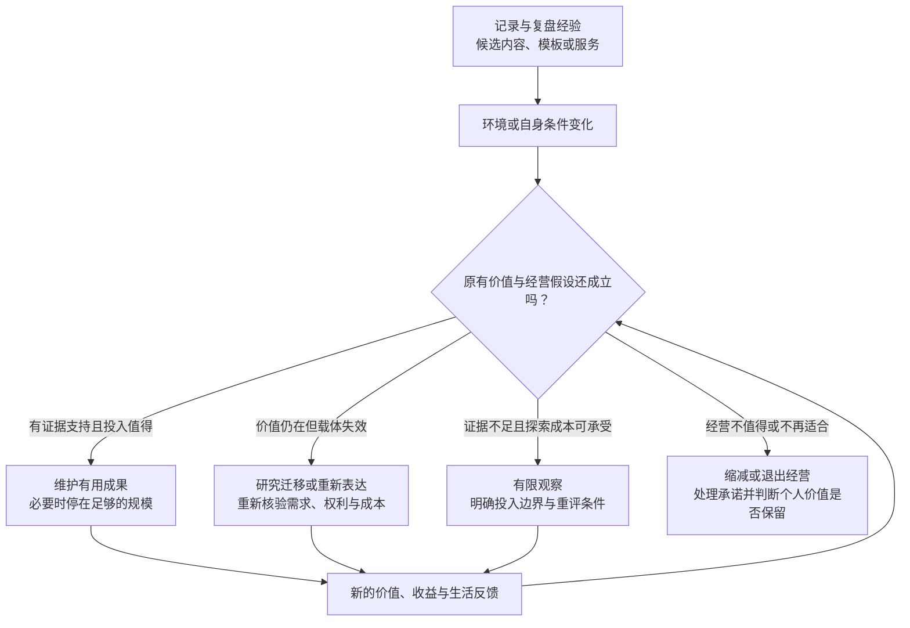

# 长期赚钱的思考框架：价值留存与选择权

总览 [[思考：长期、中期、短期赚钱方式]] · 前篇 [[短期赚钱方式：机会发现与可行判断]] · [[中期赚钱方式：持续收入与有效积累]]

> 短期问“什么适合现在的我”，中期问“什么值得持续投入”，长期问“环境和自己都改变之后，什么价值仍能留下，我还有哪些选择”。这是一组思考工具，不是赚钱方式全集、投资推荐或收益公式；具体判断仍需证据。

长期不是过了六个月就自动进入的阶段。它更关注跨年度、跨技术与生活变化的结果：收入依靠什么，积累会不会贬值，风险会不会一次抹去成果，以及自己能否改变方向。不必先有稳定收入才能考虑这些问题，也不必把所有事情都做成软件、订阅或平台。

*图一：长期不是无限扩张，而是在变化中保留有价值的成果，并重新分配时间、资金和责任。*

## 一、识别可留存价值：积累的究竟是什么

### 收益权与价值留存思维：创造的价值，能留下多少

内容、软件、设计、经营份额和实物资产，可能对应不同的使用权、收益权和处置权。作品放在自己电脑里，不代表所有素材都能转售；作品公开发表，也不代表失去全部权利。关系与信誉有价值，但用户不是自己拥有、可以任意转让的资产。

有权销售不等于有能力保留利润。如果获客入口、价格或核心供给由别人决定，即使作品原创，收益仍可能被费用、竞争和维护消耗。法律资格与经济回报需要分别判断。

**我能继续使用、授权或处置什么？谁决定交易条件？扣除长期投入后，我能保留多少收益？**

### 价值寿命思维：什么会保留，什么会折旧

工具可能随接口变化失效，文章可能随事实变化过时，品牌可能因体验下降失去信任。较稳定的需求也可能换一种满足方式。法律上仍拥有某项权利，不等于市场上仍有人愿意付款。

长期积累不要求每件旧作品永久有用。具体产品可以被替代，形成它的判断能力、原创方法和声誉仍可能迁移；但这些也要看新的使用价值，不能仅凭过去成功就认定有效。

**几年之后，对方还为什么需要它？维持价值所需的更新，会不会超过它带来的收益？**

### 积累机制思维：时间怎样改善下一次的条件

经验可能改善判断，作品可能带来发现，良好体验可能带来推荐，流程可能减少重复劳动。这些是待观察的机制，不是自动复利。金融上的收益再投入，也与内容、能力和关系的积累不同。

**哪条具体链路让过去的投入帮助了下一次？扣除维护与折旧后，留下的是优势还是负担？**

## 二、决定未来投入：不把坚持当作唯一答案

### 再投入思维：下一份资源放在哪里

已有收入可以改善现有成果、探索新方向、增加储备，也可以满足生活需要。扩大业务不是唯一合理选择。过去投入解释了现状，却不能单独证明下一笔投入值得。

前一份投入有效，不代表下一份同样有效。新增内容、广告、功能或人手可能遇到回报递减；判断再投入应看它新增了什么，而不是用整个项目过去的成绩替它背书。

**从现在开始，同样的时间和资金，放在哪里更有价值？新增回报是否值得新增成本？继续维护、扩展、保留现金或停止，各自放弃了什么？**

### 风险组合思维：多个收入来源是否真的独立

多个账号依赖同一平台、多个产品依赖同一接口、多个客户属于同一行业，可能同时受损。分散也有学习和管理成本；不能为了“多元化”同时开很多陌生业务，更不能为扩大收益承受无法承担的损失。

收入账面上为正，也可能因回款慢、资金被锁定或本人无法工作而陷入困难。缓冲不只是更多项目，还包括可动用的资源、可减少的支出和不过度承诺的余地；具体需要多少，应按自己的义务与风险判断。

**什么共同变化会同时影响这些收入？最坏情况下，生活需要、债务和已作承诺能否承受？**

### 能力迁移思维：载体消失后，还剩什么

特定工具的操作技巧可能失效，理解问题、创作表达、商业判断与合作经验则可能迁移，但也需要持续检验。内容创作可以独立发展，不必最终变成软件；技术能力也不必永远通过同一种产品出售。

**如果原来的平台、产品或职业角色不再适合，哪些能力和成果能服务新的场景？迁移需要付出什么成本？**

## 三、保留选择权：让积累服务生活，而不是反过来

### 组织与委托思维：不亲自完成，是否仍能负责

标准化、自动化和合作分工可能减轻重复劳动，却会引入管理、质量和协调成本。服务也能积累品牌、流程与团队能力；不必因为有人工作就否定其价值，也不能把委托当成责任消失。

**哪些事必须由我做，哪些可以交给流程或合作者？交出去之后，质量、回报和责任是否仍然成立？**

### 退出与可转移思维：想停的时候，是否停得下来

出售业务、授权作品、减少服务、停止更新是不同选择。客户协议、持续承诺、知识产权和个人依赖会影响能否转移；收入稳定也不代表一定有人愿意接手。

**如果要休息、转向或退出，哪些成果能保留或合法转移？用户权益、数据和未履行承诺怎样处理，退出成本是多少？**

### 生活适配思维：赚到更多，是否换来需要的生活

长期目标可以是更高收入，也可以是更稳定、更自主、能照顾家庭或保有创作时间。收入增加但注意力被长期占满，未必是自己想要的结果；亲自创作或服务也可能本身值得保留。

**如果这种经营方式持续几年，它会把我的日常生活变成什么样？这种交换是我愿意的吗？**

### 充足性思维：增长之外，什么已经足够

长期经营很容易把“还能增长”误作“应该继续增长”。收入、储备、时间自由和影响力的目标需要由自己定义；达到当前所需后，维持、降低风险、增加休息或转向创作，都可能比扩张更有价值。

**对我而言，什么结果已经足够？继续增长实际改善什么，又会牺牲什么？**

## 四、贯穿全程：检验长期假设，而不是相信长期叙事

- **价值证据：** 旧成果是否仍被使用或带来收益，还是只剩数量、估值想象和过去荣誉？
- **替代证据：** 用户为何继续选择或离开？新技术是否改变了付费理由？
- **压力证据：** 某条渠道中断、自己减少参与或成本上涨时，实际能保留什么？未经历的情况只能作情景分析。
- **投入证据：** 新投入是否改善了结果，还是只延缓承认原方向已经不适合？

**等待更久不等于判断更正确，暂时没有收入也不自动等于没有价值。** 区分已实现收益、可观察的非收入价值与尚待验证的预期，再结合可承受的投入作决定。

证据不足时，还要明确愿意继续投入多少时间、资金和精力，以及什么变化值得重新判断。有限探索与无限等待不同；只有个人使用或创作价值时，可以保留成果，但不应继续把它记作已经成立的赚钱路径。

## 五、用例子看不同的长期可能

以下是分析对象，不是项目或资产配置推荐。是否适合自己，需要分别研究权利、需求、成本与风险。

| 可能的方向 | 长期可能留下什么 | 不能据此假设什么 |
|---|---|---|
| 文字、视频、音频及原创作品 | 作品库、版权、辨识度、持续支持的读者关系；可研究内容付费、赞助、合作或授权 | 旧作品一定有长尾收入；所有读者都能转移到新平台 |
| 软件、工具与数字成品 | 原创成果、解决问题的能力、合法许可、用户经验与维护流程 | 源码天然保值；订阅天然稳定；最终必须做 SaaS |
| 专业服务与协作团队 | 专业声誉、案例、流程、合作网络及经营收益 | 客户关系完全脱离个人；增加团队人数就能提高利润 |
| 品牌、渠道或交易平台 | 持续被选择的理由、发现效率、供需信任和经营能力 | 多用户就有网络效应；流量大就拥有定价权或转售权 |
| 股权、金融或实物资产的合法收益权 | 股息、利息、租金或价值变动等不同收益可能 | 投资本金不存在损失；有现金流就没有波动、维护或流动性风险 |
| 职业与专业能力积累 | 技能、声誉、合作关系与议价能力；可以长期取得劳动收入 | 资历自然保值、必须创业才有积累，或职位稳定就没有行业风险 |
| 实体经营与资产出租 | 供应链、品牌、客户体验、实物使用价值与租赁收入 | 营业额或租金等于利润；忽略库存、空置、维修、折旧与融资成本 |

### 理财、定投与价值投资：让已有资金承担合适的任务

长期积累不只有自己经营业务，也包括用已有资金取得合法收益权。**理财是资金安排，定投是投入方式，价值投资是判断方法，资产配置是组合安排**；它们可以配合，但不能当作同一个“稳定赚钱项目”。

| 视角 | 它解决什么问题 | 需要防止的误解 |
|---|---|---|
| **理财与资金规划** | 区分日常支出、应急储备、债务与未来目标，再判断资金何时需要使用 | 理财不等于购买某个理财产品；节约支出和管理债务改善结余，但不是投资收入 |
| **定投** | 在约定时间按规则投入，减少反复择时的决策负担；投入仍须匹配现金流和目标 | 定投不会把劣质资产变好，不保证盈利或比一次投入收益更高；长期下跌仍可能造成损失 |
| **价值投资** | 研究资产的盈利能力、现金流、竞争条件与风险，比较估计价值和购买价格 | 价格低不等于便宜；估值会错，“安全边际”不是保险；长期持有不能替代持续检查原判断 |
| **资产配置与再平衡** | 结合用款期限与风险承受能力，考虑不同资产的相关性、费用和流动性 | 多买几只名称不同的基金未必分散；指数基金也有市场风险，债券也需区分信用、利率和期限风险 |

定投可以用于指数基金等投资对象，但**定投不等于指数投资，指数投资也不等于价值投资**。长期持有、分散和规律投入都只是管理过程的一部分，不能消除本金损失、通胀、费用和税费对实际结果的影响。

**这笔钱何时要用？收益由什么产生？在收入中断、市场下跌或无法及时变现时，是否仍能履行生活和经营义务？** 股息、利息与租金是现金流，资产涨价可能尚未实现；新增投入也不是投资收益。没有足够可承担风险的资金时，增加劳动收入、管理支出与保持流动性，可以先于扩大投资。

**条件案例：有结余，是否就适合定投？** 假设一位创作者有不稳定的月度结余，而非假定本文作者已有这些收入。先区分待缴税费、未来交付成本、生活与近期用款，再研究是否有真正可长期投入的余额。若有，再比较标的、分散程度、费用与风险；若收入下降，投入安排也要重新判断，而不是借钱维持所谓纪律。即使选择价值投资，也要允许估值和经营判断被新事实推翻。

这一案例分别使用了收益权、价值寿命、积累机制、再投入、风险组合与充足性：**投资是让可用资金服务目标，不是用风险补足眼前现金缺口，也不是把本金增加误认为已经赚到钱。** 本文不指定标的、投入比例或收益率。

概念参考：[Investor.gov：定投定义](https://www.investor.gov/introduction-investing/investing-basics/glossary/dollar-cost-averaging)；[Investor.gov：分散投资](https://www.investor.gov/introduction-investing/investing-basics/glossary/diversification)。这里引用基础定义，不据此推导收益承诺。

### 完整案例：记录与复盘经验，什么值得留下几年？

**实际起点：** 当前记录库已有每日记录与周期复盘结构。前两篇从这里推演内容、模板和有限服务。本篇继续讨论长期选择，**不假定已经商业化、拥有受众或取得可出售的业务**。

| 思维视角 | 放进这个案例后怎样判断 |
|---|---|
| **收益权与价值留存** | 区分原创说明、第三方插件、个人记录与合作作品；核对哪些部分有权公开或授权，也看渠道费用、定价和维护后能留住多少收益。不把私人数据和读者关系当作可出售素材。 |
| **价值寿命** | 具体插件配置可以失效，方法与表达能力却可能迁移；是否仍有用需重新判断，不必为保住旧产品而永久维护。 |
| **积累机制** | 旧文章是否持续帮助理解，新反馈是否改善示例，维护是否更省力？没有这些迹象，文件更多不能证明积累更强。 |
| **再投入** | 下一段时间用于修模板、写解释、研究新场景还是暂缓商业化？看新增投入带来的改善，不能因过去写了很多或曾有回报，就继续增加功能。 |
| **风险组合** | 内容、模板与服务若都依赖同一平台或插件，并非三个独立的风险来源。还要判断回款中断或本人暂时无法工作时，已有资源能否覆盖生活与承诺；增加渠道也要比较维护成本。 |
| **能力迁移** | 结构化表达与复盘方法能否用于另一种工具或内容形式？需要重新证明适用性，而不是直接搬运原来的承诺。 |
| **组织与委托** | 编辑、常见问题答复是否能合理分工？如果用户购买的是个人判断，不能假装完全交给自动化仍是同一种服务。 |
| **退出与可转移** | 不再维护时能否保留原创作品、停止新销售并妥善处理旧承诺？模板与版权可能有不同处置方式，不能假定一定能找到买家。 |
| **生活适配** | 自己更愿意长期写作、做工具还是服务他人？如果复盘产品反而占满生活，收入目标与原来的需要可能发生冲突。 |
| **充足性** | 即使内容或模板带来收入，也要问现有收益、时间自由和个人使用价值是否已满足当前目标；若是，维持而非继续扩张同样是合理选择。 |
| **长期检验** | 若方法仍有用但插件包折旧快，可以保留内容、停止扩展配置；若付费需求消失，可以停止经营而保留个人使用价值。 |

*图二：这是条件推演，不是已经实现的收益路径。转向不保证成功，退出商业化也不等于否定个人经验的价值。*

**案例中的判断变化：** 若模板不再适配新工具，但原创解释仍被需要，值得研究的可能是保留内容而非重做全部配置；若内容虽受欢迎，却无法以可承受投入获得收入，可以将其保留为个人创作，而不继续把它当赚钱项目；若已有承诺超过自己的承受能力，退出也需要安排履约，而不是简单关停。

### 反面案例：经营很久、渠道很多，仍可能没有积累选择权

假设一个卡券转售业务有多个店铺，但货源都来自同一家供应商，销量靠持续补贴，售后主要依赖本人。经营年限和店铺数量不能证明它已经成为稳健资产。

反过来，若供给合法可靠、客户来源可复现、净回报与责任相称，也不能因为“转售”就否定它。**长期判断看的是可保留的收益、共同风险和可退出程度，而不是行业标签。** 这是条件分析，不是对具体卖家盈利的断言。

## 六、使用与维护

- **本篇保留长期问题**，不堆平台规则、投资标的或操作步骤；与短期、中期框架交叉使用，不按经营月份机械切换。
- **同一方向沿用一份研究笔记**，补充多年可能变化的前提、实际观察与重新判断，不复制成三套项目清单。
- **明确记录保留、更新、转向或停止的理由**，区分经验、现象、推断和反证。平台与投资事实应在具体研究中核验。

长期赚钱不只是把收入维持得更久，而是让有用成果跨越变化，同时让自己保有选择：**继续、委托、改变，或在履行责任之后停下来。**
