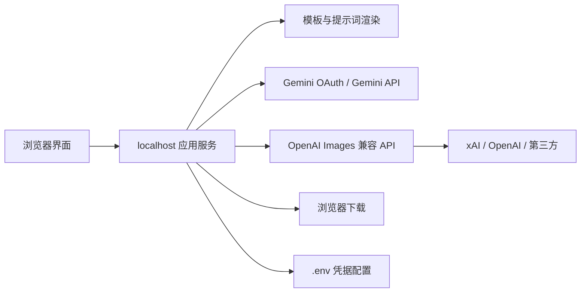

# 本机生图工具提案

关联：[[2026-09-10]]

## 问题

现有生图服务各自有不同的模型、密钥与提示词界面。目标不是再做一个带账号、积分和支付的平台，而是给单个用户一个本机工具：用结构化模板快速组织提示词，按所选服务商生成图片并直接下载。

参考 [[https://github.com/freestylefly/awesome-gpt-image-2|awesome-gpt-image-2]] 的价值在其可复用的 Prompt-as-Code 思路、案例分类和模板结构；不复制其 Supabase 登录、平台积分、支付或云端业务。

## 已确认决策

| 决策 | 选择 | 理由 |
| --- | --- | --- |
| 交付形态 | 独立本机网页 | 单人使用；不需要公开部署、账号或云端数据。 |
| 运行结构 | 浏览器前端 + localhost 后端 | 后端承接服务商调用和 Google OAuth 回调，避免把令牌交给前端代码。 |
| Gemini | Google OAuth | 使用用户自己的 Google Cloud 项目与 OAuth Client 授权 Gemini API。 |
| OpenAI、xAI/Grok、第三方 | OpenAI Images 兼容配置 | 每个服务商配置名称、Base URL、API Key、模型名；xAI 是内置预设，第三方必须兼容 Images 协议。 |
| 凭据持久化 | 本地 `.env` 文件 | 用户明确选择。它会以明文保存在本机，必须排除在版本控制之外。 |
| 首版闭环 | 选模板 → 填变量 → 生成 → 下载 | 优先完成可用闭环；不保存生成历史。 |
| 提示词资产 | 12 个可填充模板 | 比完整导入 500+ 案例更符合简易工具定位，后续可按需增加。 |

## 产品边界

### 首版包含

1. **服务商设置**
   - Gemini OAuth 连接状态，以及 Google Cloud 项目、OAuth Client 的本机配置说明。
   - OpenAI、xAI/Grok 的预设服务商。
   - 自定义兼容服务商：名称、Base URL、API Key、模型名。
   - API Key 只写入本机 `.env`，设置页不回显完整密钥。

2. **模板化提示词**
   - 模板选择、变量表单和可编辑的最终提示词预览。
   - 初始 12 个模板：商品主视觉、商品细节页、商业产品摄影、人像摄影、编辑海报、品牌视觉、信息图、社交媒体视觉、插画、角色设定、叙事场景、知识文档版式。
   - 模板只提供结构与字段；用户仍可修改最终提示词。

3. **生成与下载**
   - 选择服务商、模型、长宽比、分辨率和生成数量（只在该服务商支持时显示）。
   - 显示生成中、可理解的失败信息与结果预览。
   - 将结果保存为本地下载；不建云端图库、不建用户历史。

### 首版不包含

- 多用户账户、公开访问、支付、积分、用量计费或服务端代付。
- 图生图、参考图编辑、批量队列、协作、收藏夹和历史库。
- 任意 HTTP 请求模板。第三方仅支持 OpenAI Images 兼容协议，避免不可验证的请求配置与密钥泄露面扩大。

## 服务商契约

### Gemini

Gemini API 官方文档支持 OAuth，但需用户自己创建 Google Cloud 项目、启用 Google Generative Language API、配置 OAuth consent screen 与 OAuth Client。首次连接会在浏览器完成授权，本机后端保存可刷新凭据并调用 Gemini 图像生成能力。

这不是复用 Gemini 网页订阅；额度、权限和计费由所选 Google Cloud 项目决定。

### OpenAI、xAI/Grok 与第三方

统一使用 `POST /v1/images/generations` 的 OpenAI Images 兼容方式。OpenAI 官方 API 使用 bearer API key；xAI 官方文档明确支持该路径，示例模型为 `grok-imagine-image-2.0`。自定义服务商能接入的前提是它接受等价的 `model`、`prompt` 与图像参数并返回图片 URL 或 Base64 数据。

## 本机架构

- 浏览器只与本机服务通信；服务商请求由本机后端发出。
- `.env` 保存 API Key、Google OAuth Client 配置及刷新令牌路径；它必须在 `.gitignore` 中，并将文件权限限定为当前用户可读。
- 生成结果仅在当前页面展示，下载后由浏览器保存。关闭或刷新页面后不保证仍可查看。

## 主要流程

1. 打开本机网页，选择模板。
2. 填写模板变量；工具生成并显示最终提示词，用户可手动修改。
3. 在设置中选择已配置的服务商和模型，设置长宽比、分辨率、数量。
4. 点击生成。本机后端按服务商适配器调用 API。
5. 工具展示结果；用户点击下载。

## 交付验收

- 在 macOS 上一条命令启动本机工具，并在浏览器完成一次真实生成。
- Gemini OAuth 能完成授权、刷新凭据并生成一张图片；若 Cloud 配置缺失，给出具体配置缺项。
- OpenAI、xAI 与任一兼容第三方均可通过设置页保存配置，并对其 Images 端点发送生成请求。
- 12 个模板均能生成可编辑提示词；模板变量缺失时不能发起请求。
- 成功生成的图片可在浏览器预览和下载；服务商的错误状态可见且不泄露密钥。
- `.env` 不被版本控制追踪，界面不显示完整 API Key 或 OAuth refresh token。

## 风险与待验证项

- **明文凭据风险：** `.env` 比 macOS Keychain 更容易被本机其他进程、备份或误提交读取；这是已确认的权衡。实现时至少限制权限并阻止提交。
- **Gemini 前置条件：** 用户需要拥有可配置 OAuth 的 Google Cloud 项目；这一步不能由应用绕过。
- **兼容性边界：** “OpenAI 兼容”并不保证所有中转服务都支持相同的尺寸、数量、返回格式或模型能力。应用应只将通用字段发给自定义服务商，并显示其原始错误摘要。
- **提示词资产：** 12 个模板的具体字段与许可证标注在实现前需从参考仓库对应模板逐项选定；本提案只确定了类别，不声称已验证每个案例的可商用性。

## 证据

- [awesome-gpt-image-2 README](https://github.com/freestylefly/awesome-gpt-image-2)：该仓库提供 Prompt-as-Code、模板库和 MIT License 声明；其站点功能还包含登录、积分与支付，均不在本提案范围内。
- [Gemini API OAuth quickstart](https://ai.google.dev/gemini-api/docs/oauth)：OAuth 需要 Cloud 项目、启用 API 与 OAuth Client；官方将 API Key 作为更容易的起点。
- [OpenAI API authentication](https://developers.openai.com/api/reference/overview)：应用请求使用 API key 或 workload identity token，并要求不要在客户端暴露 API key。
- [xAI Images API](https://docs.x.ai/developers/rest-api-reference/inference/images)：支持 `POST /v1/images/generations`，并给出 OpenAI SDK 兼容示例。

## 后续

`image-workbench` 接收本提案作为唯一输入，并在其自身仓库中将已确认的范围转化为实现 spec。DailyVault 只保留本提案及其探索证据，不预先维护实现规格。