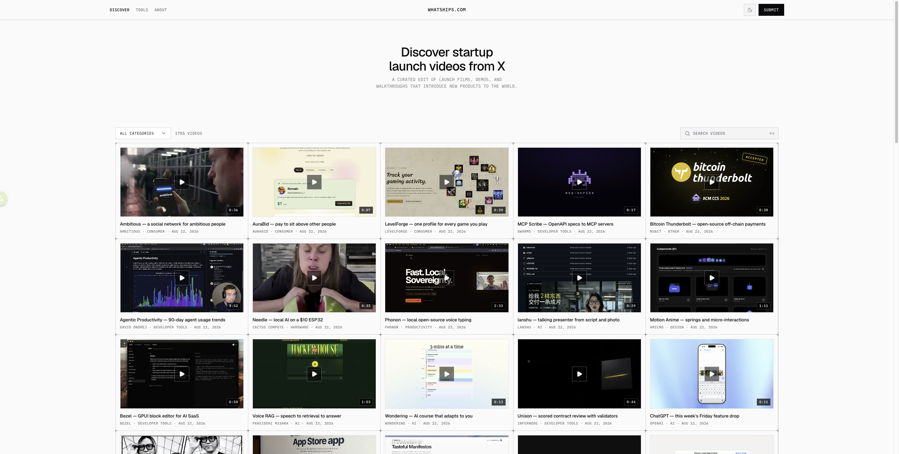

# 从 X 上发现初创公司的产品发布视频

[Whatships](https://whatships.com/)

老师做了一个工具，把在 X 上一些产品的发布视频收集了起来，不少视频做得很好，挺值得学习。下次有产品需要发布时，可以去看看有没有新的思路。

## 基本信息

| 项目   | 信息                         |
| ---- | -------------------------- |
| 平台   | X/Twitter                  |
| 内容   | 初创公司产品发布视频、演示和 walkthrough |
| 浏览方式 | 分类浏览、关键词搜索                 |
| 定价   | 未知                         |
| 创建者  | 未知                         |

## 它是什么

Whatships 是一个从 X/Twitter 汇集初创公司产品发布视频、产品演示和产品 walkthrough 的精选目录。首页以卡片形式展示视频，可以按分类浏览，也可以搜索视频。

## 为什么值得收藏

- 观察其他初创公司如何介绍产品和讲述产品价值。
- 学习产品发布视频的结构、节奏和视觉表达。
- 为自己的产品发布寻找新的演示方式和叙事思路。
- 在产品上线前快速浏览同类产品的发布案例。

## 适合什么时候使用

- 准备制作产品发布视频时。
- 需要优化产品首页或产品演示时。
- 研究初创公司的产品营销表达时。
- 想收集产品设计、交互和演示灵感时。

## 我的判断

这是一个适合持续浏览的产品发布案例库。它的价值不只是发现产品，也在于观察不同团队如何用很短的视频解释产品、展示功能并制造兴趣。
