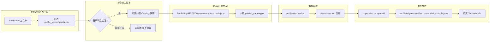
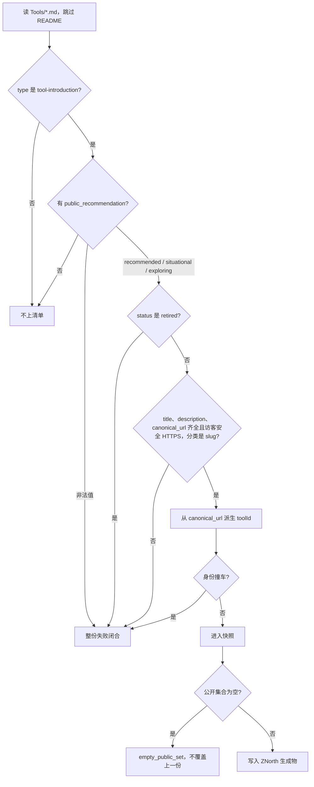
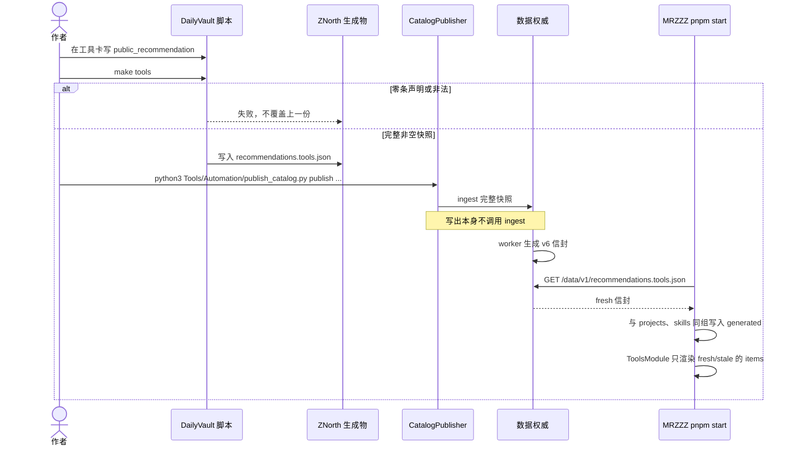

# 公开软件推荐管线规格

> 版本：v1
>
> 状态：已确认（管线；不含第一批公开点名）
>
> 对应工单：[Issue #1](https://github.com/codeshareman/DailyVault/issues/1)
>
> 决策背景：[ADR-0001](adr/0001-public-software-recs-from-tool-cards.md)、[CONTEXT.md](../CONTEXT.md)

本文件是 DailyVault 这一侧的产品与实现契约。GitHub Issues 是拆票，不是规格原文。实现与验收以本文为准。

## Problem Statement

MRZZZ 首页「软件推荐」现在只显示一份公开 Catalog（目前只有 pnpm）。这份清单像是在 ZNorth 里单独写的，和 DailyVault 里的工具卡不是同一份记录。ZNorth 工作树里甚至没有这份快照。

我不想再维护一份少用的推荐 JSON，也不想手写 `toolId`。日常就是写 Markdown 工具卡，最多补 frontmatter。DailyVault 里有大量收藏，但收藏不是推荐。每日待办、输入、输出会提到工具，那是当天的工作痕迹，不能自动变成对访客的公开肯定。

## Solution

工具卡是唯一源。要上首页，只在卡上写 `public_recommendation`。本仓脚本读这些声明，从 `canonical_url` 生成派生身份，拼出完整非空的 Catalog 快照，写入 ZNorth。人再按发布闸。MRZZZ 的 `pnpm start` 只拉已经发布的信封。

`pnpm start` 不读 DailyVault，也不读 ZNorth 工作树。它只拉已经发布的信封。保存工具卡或 git push 都不发网。

筛选规则：

发布之后，`pnpm start` 怎么更新首页：

## User Stories

1. 作为作者，我想用 Markdown 写工具卡，这样日常收藏不用改工作方式。
2. 作为作者，我想只加一个可选的 `public_recommendation` 字段，这样就不必手写 `toolId` 或另开一份名单。
3. 作为作者，我想省略该字段就等于不上首页，这样四百多张收藏不会全部公开。
4. 作为作者，我想推荐态只有 `recommended`、`situational`、`exploring`，这样和首页已有语义一致。
5. 作为作者，我想默认模板不出现覆盖 slug，这样新卡上看不到我不想填的空位。
6. 作为作者，我想名称、摘要、网址、分类都跟工具卡走，这样公开文案只有一份。
7. 作为作者，我想卡不够公开水准时先改卡再声明，这样投影层不能另写摘要。
8. 作为访客，我想看到的是公开肯定，而不是整份收藏目录。
9. 作为访客，我不想把「正在用」或「今日发现」当成推荐。
10. 作为作者，我不想每日计划、输入、输出单独开出一条公开推荐。
11. 作为作者，我想保存工具卡或 git push 都不发网，这样收藏不会偷偷变成公开站点。
12. 作为作者，我想由脚本把完整快照写入 ZNorth，这样发布闸仍由人按。
13. 作为作者，我想 `canonical_url` 能唯一对准一张卡，这样派生身份不会指错。
14. 作为作者，我想撞车时失败闭合，这样不会默默合并两张职业资格站点卡。
15. 作为作者，我想只有撞车的那一张卡才写可选覆盖，这样日常仍不写 ID。
16. 作为站点维护者，我想空的公开集合不能发布，这样漏传不会清空首页。
17. 作为站点维护者，我想拿掉首页推荐只能显式 disable，这样和技能模块同一条失败闭合。
18. 作为站点维护者，我想 MRZZZ 首页模块和同步管线保持原状，这样本轮不必改渲染。
19. 作为站点维护者，我想 `pnpm start` 仍只拉已发布信封，这样和技能模块同一条同步。
20. 作为作者，我想已退役却仍被声明公开的卡让脚本失败，这样不会把失效收藏送上首页。
21. 作为作者，我想第一份派生快照可以很小，这样不必先点名全部收藏。
22. 作为作者，我接受当前首页的 pnpm 若不补卡并声明，就不会出现在下一份派生快照里。

## Implementation Decisions

- 唯一源是工具卡。公开推荐声明是卡上的字段，不是独立名单。
- 作者日常只改工具卡模板和 Markdown。`toolId` 不是作者配置。
- 派生身份从 `canonical_url` 按稳定规则生成。GitHub 用 `owner-repo`，npm 用包名，其余用可区分的注册名。规则属于脚本，不写进模板。
- 两张被声明公开的卡得到同一派生身份时，脚本失败闭合。那一张卡才允许可选覆盖字段；默认模板不预留。
- 信封里的名称来自 `title`，摘要来自 `description`，网址来自 `canonical_url` 且必须是访客安全 HTTPS。分类来自卡上已有的 slug（`category` 与 `subject`），不得超过公开信封上限，脚本不另造类名。
- 文案跟卡走，不在投影层做翻译或改写。
- 本仓脚本的输出必须是完整非空的 Catalog 快照，形状能被现有 `CatalogPublisher` 当作 `recommendations.tools` 发布。零条公开声明是失败，不是清空。
- 脚本写入 ZNorth 的生成快照；ZNorth 仍是发布闸。本仓不直连 ingest，也不改 MRZZZ 的软件推荐模块。
- `status: retired` 同时带 `public_recommendation` 时失败闭合。
- 非法推荐态、缺 `canonical_url`、网址不安全、分类不是 slug，都在写出快照前失败闭合。
- Catalog 仍与项目、技能同组原子批次。派生快照必须保持完整非空形状，否则整批同步失败。

## Testing Decisions

测试只钉在派生脚本这一条缝：给定一组工具卡（含或不含公开推荐声明），脚本要么写出完整合法快照，要么失败闭合。不断言文件布局，不启动 ingest，不渲染首页。

好测试只看对外行为：

- 省略 `public_recommendation` 的卡不出现在快照里。
- 声明合法时，快照含派生身份、名称、摘要、网址、分类、推荐态。
- 两张公开卡撞身份、退役仍声明、空声明集合、非法推荐态、不安全网址，都必须失败而不是写出残缺快照。

本仓目前没有同类投影测试。对照物是职业档案仓的公开技能派生，以及 ZNorth Catalog 发布器对完整非空快照的拒绝规则。测试夹具用匿名工具卡，不把真实收藏正文写进断言。

## Out of Scope

- 给现有四百多张卡批量填写 `public_recommendation`
- 从每日记录、待办或使用次数自动点名
- 在 DailyVault 里做推荐浏览 UI
- 内建 MRZZZ 或 ZNorth 的发布/同步改动
- 自动按发布闸
- 从现有 pnpm 信封倒灌一张工具卡
- 把收入机会研究的「推荐」语义改成公开软件推荐

## Further Notes

当前数据权威上的 pnpm 条目不在工具卡里。本管线生效后，除非补卡并声明，否则它不会再出现在派生快照中。这是源边界的后果，不是遗漏。

### 2026-09-18 管线验证

父票 [#1](https://github.com/codeshareman/DailyVault/issues/1) 在第一批公开点名经发布闸落到信封之前保持开放。本轮验证了提取、筛选和 `pnpm start` 的 Catalog 同步，没有按发布闸，也没有给真实工具卡写 `public_recommendation`。

- 真实 `Tools/`：408 个 Markdown，406 张 `tool-introduction`，0 条 `public_recommendation`。`make tools` / 派生得到 `empty_public_set`，不写出文件。没有名为 pnpm 的工具卡。
- 临时目录混入真实卡（ChatGPT 声明 `recommended`，Dribbble / Daylio 省略）：快照只有 ChatGPT；`toolId` 为 `chatgpt-com`；文案和分类跟卡走。
- 该快照通过 ZNorth `CatalogPublisher._validate_items`。空 `items` 被 `publish_snapshot` 拒绝。
- 把同一 `items` 包进 v6 信封后，MRZZZ `parseRecommendationsToolsV6Envelope` 与首页 resolver 接受；裸 Catalog 快照（没有信封包装）被拒绝。这是故意的：`pnpm start` 吃信封，不吃 ZNorth 文件。
- 在 MRZZZ 仓对 `https://data.mrzzz.top` 运行 `sync-publication-catalogs-from-backend`（`pnpm start` → `sync-all` 的 Catalog 步）：`profile.projects`、`profile.skills`、`recommendations.tools` 均为 `fresh`。本地 `src/data/generated/recommendations.tools.json` 仍是 2026-09-10 的 pnpm 信封，`changed=false`。

因此：文件能提取和筛选；`pnpm start` 能从已发布信封更新（或确认未变）首页数据。首页要换成 DailyVault 派生结果，还差两步本规格故意留给人：点名至少一张卡，再按发布闸。

